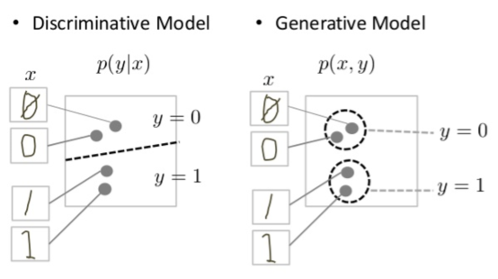
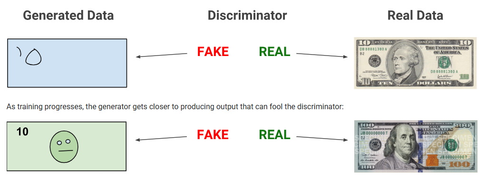
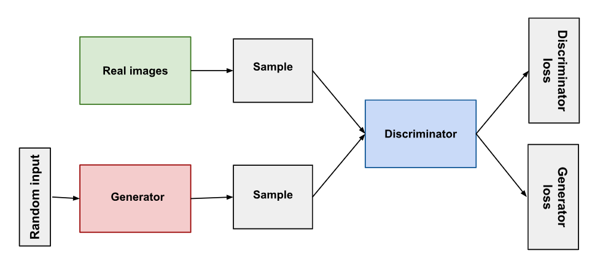
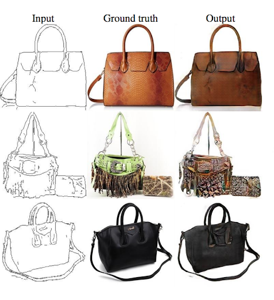
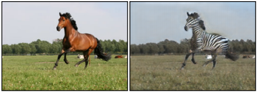
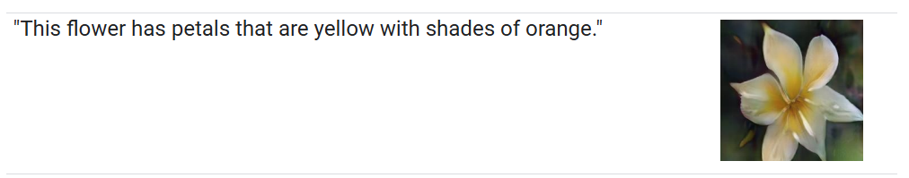
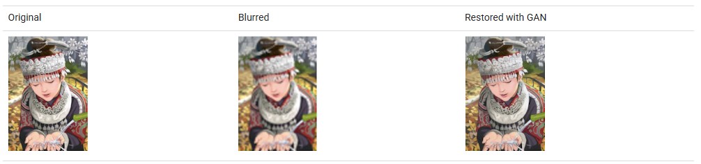
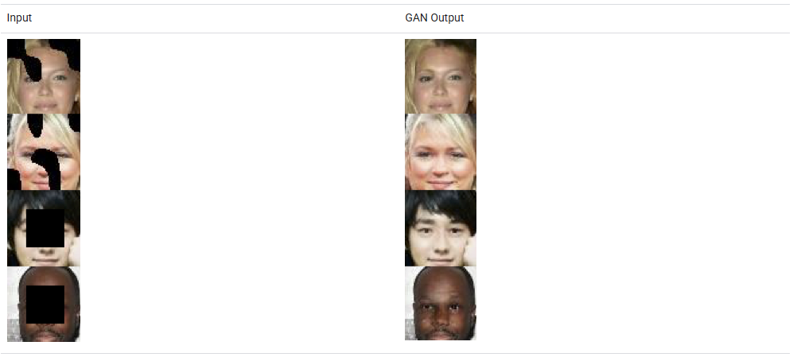

# Generative adversarial networks (GAN)
- generative models
- can create images that look like photographs of human faces
- pairing a generator, which learns to produce the target output
- with a discriminator, which learns to distinguish true data from the output of the generator
- 

## Background
- "Generative" describes a class of statistical models that contrasts with discriminative models
- Generative models can generate new data instances.
- Discriminative models discriminate between different kinds of data instances.
- Generative models capture the joint probability p(X, Y), or just p(X) if there are no labels.
- Discriminative models capture the conditional probability p(Y | X).
- Discriminitive example: decision tree
- Discriminative models try to draw boundaries in the data space, while generative models try to model how data is placed throughout the space

## Overview of GAN structure
- generator learns to generate plausible data
- discriminator learns to distinguish the generator's fake data from real data
- Both the generator and the discriminator are neural networks
- Through backpropagation, the discriminator's classification provides a signal that the generator uses to update its weights

## Discriminator training
- Training data: Real data instances, such as real pictures of people
- Fake data instances created by the generator (negative examples)
- During discriminator training the generator does not train
- Steps:
  - The discriminator classifies both real data and fake data from the generator.
  - The discriminator loss penalizes the discriminator for misclassifying a real instance as fake or a fake instance as real.
  - The discriminator updates its weights through backpropagation from the discriminator loss through the discriminator network.

## Generator training
- random input: random noise, smaller dimension than the dimensionality of the output space
- generator network, which transforms the random input into a data instance
- discriminator network, which classifies the generated data
- discriminator output
- generator loss, which penalizes the generator for failing to fool the discriminator
- Backpropagation adjusts each weight in the right direction
- Steps:
  - Sample random noise.
  - Produce generator output from sampled random noise.
  - Get discriminator "Real" or "Fake" classification for generator output.
  - Calculate loss from discriminator classification.
  - Backpropagate through both the discriminator and generator to obtain gradients.
  - Use gradients to change only the generator weights.
 
## GAN Training
- GANs must juggle two different kinds of training (generator and discriminator).
- GAN convergence is hard to identify.

## Alternating Training
- The discriminator trains for one or more epochs.
- The generator trains for one or more epochs.
- Repeat steps 1 and 2 to continue to train the generator and discriminator networks.

## Convergence
- As the generator improves with training, the discriminator performance gets worse
- the discriminator feedback gets less meaningful over time
- convergence is often a fleeting, rather than stable, state

## Loss functions
- reflect the distance between the distribution of the data generated by the GAN and the distribution of the real data.
- minimax loss: the generator tries to minimize the function while the discriminator tries to maximize it
- Wasserstein loss: The default loss function for TF-GAN Estimators.
  - The discriminator tries to maximize the critic loss (difference between its output on real instances and its output on fake instances)
  - The generator tries to maximize the generator loss (discriminator's output for its fake instances)
  - Requires constrained range of weights
- A GAN can have two loss functions: one for generator training and one for discriminator training
- Wasserstein GANs are less vulnerable to getting stuck than minimax-based GANs, and avoid problems with vanishing gradients
- The earth mover distance also has the advantage of being a true metric: a measure of distance in a space of probability distributions.
- Cross-entropy is not a metric in this sense

## Common Problems
- Vanishing gradients: if your discriminator is too good, then generator training can fail due to vanishing gradients
  - Modified minimax loss can help
  - Wasserstein loss 
- Mode collapse: Each iteration of generator over-optimizes for a particular discriminator, and the discriminator never manages to learn its way out of the trap. As a result the generators rotate through a small set of output types
  - Wasserstein loss can help
  - Unrolled GANs: generator loss function that incorporates outputs of future discriminator versions
- Failure to converge
  - Adding noise to discriminator inputs
  - Penalizing discriminator weights
 
## GAN variations
- Progressive GANs: generator's first layers produce very low resolution images, and subsequent layers add details
- Conditional GANs: train on a labeled data set and let you specify the label for each generated instance
- Image-to-Image Translation: take an image as input and map it to a generated output image with different properties

- CycleGAN: transform images from one set into images that could plausibly belong to another set

- Text-to-Image Synthesis: take text as input and produce images that are plausible and described by the text

- Super-resolution: increase the resolution of images, adding detail where necessary to fill in blurry areas

- Face Inpainting: semantic image inpainting task. In the inpainting task, chunks of an image are blacked out, and the system tries to fill in the missing chunks.

- Text-to-Speech: produce synthesized speech from text input

