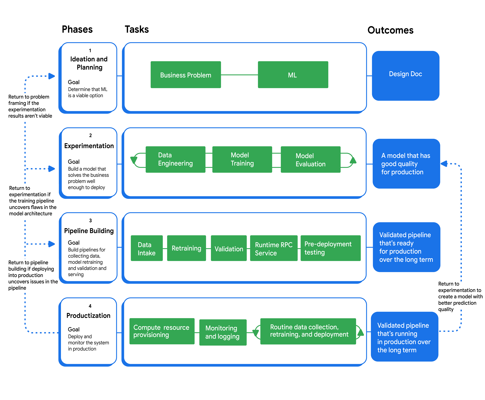

# Managing ML projects
https://developers.google.com/machine-learning/managing-ml-projects?_gl=1*12739yv*_up*MQ..*_ga*MTYwNzI2NTMzMC4xNzYyNTI0Njk5*_ga_SM8HXJ53K2*czE3NjI1MjQ2OTkkbzEkZzAkdDE3NjI1MjQ2OTkkajYwJGwwJGgw

Implementing ML consists of the phases:
- Ideation and planning: determine if ML is the best solution to your problem
- Experimentation: build a model that solves the business problem
- Pipeline building: build and implement the infrastructure for scaling, monitoring, and maintaining models in production
- Productionisation

Assembling an ML team
- ML product manager
- Engineering manager
- Data scientist
- ML engineer
- Data engineer
- Developer operations (DevOps) engineer

Establish team practices
- Process documentation: model, training, data, SQL, infrastructure, production, pipelines, maintenance, communication
-  establish common practices through excellent process documentation
-  define goals and terminology
-  define good practice
-  standardisation
-  reduces confusion and streamlines the development process

Performance evaluations
-  set clear expectations and define deliverables early
-  consider how they'll be evaluated if a project or approach isn't successful

Stakeholders
- define your project's stakeholders, the expected deliverables, and the preferred communication methods
- Design doc:  explains the problem, the proposed solution, the potential approaches, and possible risks
- Experimental results:
  - The record of your experiments with their hyperparameters and metrics.
  - The training stack and saved versions of your model at certain checkpoints.
- Production-ready implementation: explain modeling decisions, deployment and monitoring specifics, and data peculiarities
-  be clear about the complexities, timeframes, and deliverables at each stage of project

