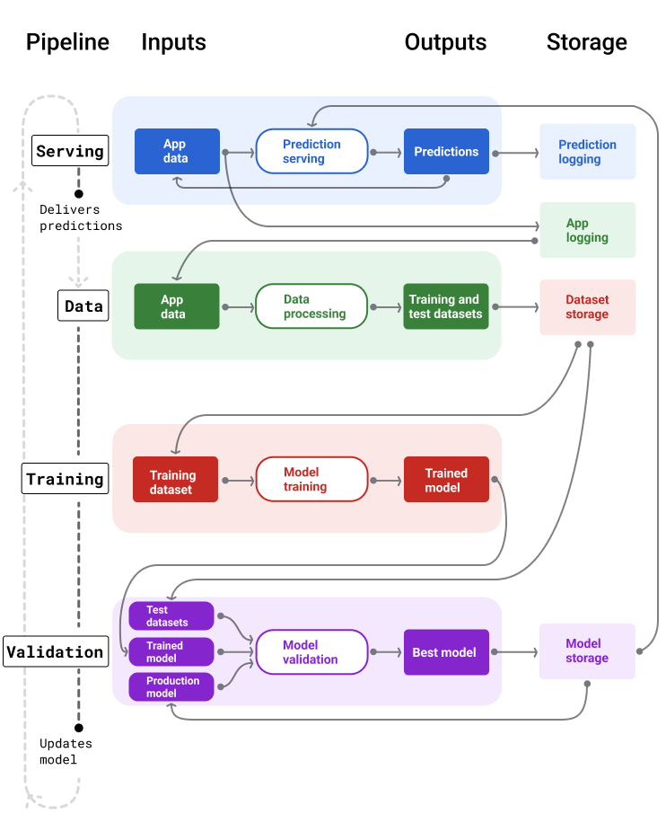

# Managing ML projects
https://developers.google.com/machine-learning/managing-ml-projects?_gl=1*12739yv*_up*MQ..*_ga*MTYwNzI2NTMzMC4xNzYyNTI0Njk5*_ga_SM8HXJ53K2*czE3NjI1MjQ2OTkkbzEkZzAkdDE3NjI1MjQ2OTkkajYwJGwwJGgw

Implementing ML consists of the phases:
- Ideation and planning: determine if ML is the best solution to your problem
- Experimentation: build a model that solves the business problem
- Pipeline building: build and implement the infrastructure for scaling, monitoring, and maintaining models in production
- Productionisation

Assembling an ML team
- ML product manager
- Engineering manager
- Data scientist
- ML engineer
- Data engineer
- Developer operations (DevOps) engineer

Establish team practices
- Process documentation: model, training, data, SQL, infrastructure, production, pipelines, maintenance, communication
-  establish common practices through excellent process documentation
-  define goals and terminology
-  define good practice
-  standardisation
-  reduces confusion and streamlines the development process

Performance evaluations
-  set clear expectations and define deliverables early
-  consider how they'll be evaluated if a project or approach isn't successful

Stakeholders
- define your project's stakeholders, the expected deliverables, and the preferred communication methods
- Design doc:  explains the problem, the proposed solution, the potential approaches, and possible risks
- Experimental results:
  - The record of your experiments with their hyperparameters and metrics.
  - The training stack and saved versions of your model at certain checkpoints.
- Production-ready implementation: explain modeling decisions, deployment and monitoring specifics, and data peculiarities
-  be clear about the complexities, timeframes, and deliverables at each stage of project

---

## Feasibility
- Data availability
- Problem difficulty
- Prediction quality
- Technical requirements
- Cost

Data availability
- Quantity: labels
- Feature availability at serving time
- Regulations

Generative AI data
- Prompt engineering, parameter efficient tuning, and fine-tuning.
- Need 10-10,000's samples
- Up-to-date information
- fine-tuning
- retrieval-augmented generation (RAG)
- periodic pre-training

Problem difficulty
- Has a similar problem already been solved? -  Kaggle or TensorFlow Hub
- Is the nature of the problem difficult? - compare to human's sucess rate
- Are there potentially bad actors? - Will people be actively trying to exploit your model? e.g. email spam

Generative AI vulnerabilities
- Input source
- Output use
- Fine-tuning

Prediction quality
- type of prediction
- consequences of false positives / false negatives
- the higher the required prediction quality, the harder the problem
- higher quality = higher cost

Generative AI considerations
- Factual accuracy - increase in cost
- Output quality - legal and financial consequences

Technical requirements
- Latency: How fast do predictions need to be served?
- Queries per second (QPS)
- RAM usage
- Platform: Online (queries sent to RPC server), WebML (inside a web browser), ODML (on a phone or tablet), or offline (predictions saved in a table)
- Interpretability
- Retraining frequency: frequent retraining can lead to significant costs

Generative AI requirements
- Platform: consider your product or service's latency, privacy, and quality constraints when choosing a model size
- Latency: Model input and output size affects latency
- Tool and API use: the more tools needed to complete a task, the more chances exist for propagating mistakes and increasing the model's vulnerabilities

Cost
- Human costs: proof of concept to production
- Machine costs: compute and memory, licencing fees
- Inference cost: Will the model need to make hundreds or thousands of inferences that cost more than the revenue generated?

---

## ML project planning
- Project uncertainty: significant increase in effort but only minimal gains in model quality
- Experimental approach:
  - Time box the work: Set clear timeframes to complete tasks or attempt a particular solution
  - Scope down the project requirements: critical features come first
  - Intern or new hire project
- Attempt approaches with the lowest costs, but potentially the highest payoff, first.
- Estimate the cost and chance of success for each approach.
- Attempt a portfolio of approaches.
- Identify lessons learned and try to improve the system one thing at a time.
- Plan for failures.

---

## Measuring success
- Business metrics: Metrics for quantifying business performance, for example, revenue, click-through rate, or number of users.
- Model metrics: Metrics for quantifying model quality, for example, Root Mean Squared Error, precision, or recall.

Business metrics examples
- Reduce a datacenter's monthly electric costs by 30 percent.
- Increase revenue from product recommendations by 12 percent.
- Increase click-through rate by 9 percent.
- Increase customer sentiment from opt-in surveys by 20 percent.
- Increase time on page by 4 percent.

Model metrics
- Determine a single metric to optimize
- Determine acceptability goals to meet: goals a model needs to meet to be considered acceptable for an intended use case

Connection between model metrics and business metrics
- If model metrics are good, it doesn't mean business metrics will be.
- Predictions don't occur early enough to be actionable.
- Incomplete features
- Threshold isn't high enough

---

## Experiments
- viability tests
- testable and reproducible hypotheses
- continual, incremental improvements
- variety of model architectures and features
- Determine baseline performance
- Make single, small changes: hyperparameters, architecture, or features
- Record the progress of the experiments.

Noise in experimental results
- Data shuffling: order in which the data is presented 
- Variable initialization: way in which the model's variables are initialized
- Asynchronous parallelism: order in which the different parts of the model are updated
- Small evaluation sets: may not be representative

Align on experimentation practices
- Artifacts: logging the metadata
- Coding practices: venv
- Reproducibility and tracking: standards, logging, DB.

Wrong predictions
- How will your system handle wrong predictions?
- correctly label wrong predictions
- automated feedback loops

Implement an end-to-end solution
- Establishing different pieces of the pipeline—like data intake and model retraining—makes it easier to move the final model to production.

Troubleshooting stalled projects
- Strategic: reframe the problem.
- Technical: Spend time diagnosing and analyzing wrong predictions

---

## ML pipelines
- The goal is to build automated pipelines for developing, testing, and deploying models over time
- Models typically need retraining with up-to-date data to continue serving high-quality predictions over the long term.

Building pipelines
- Delivering predictions: receives and processes the user's data, makes a prediction, and then delivers it to the user
- Updating the model:
  - Data pipeline: create training and test datasets
  - Training pipeline: train model
  - Validation pipeline: compare to production model using test datasets
 
 

Model staleness and training frequency
- A recommended best practice is to train and deploy new models on a daily basis.
- If the data is dynamic, train often. If it's less dynamic, you might not need to train that often.

Serving pipeline
- Online predictions: happen in real time, typically by sending a request to an online server and returning a prediction
- Offline predictions: precomputed and cached

Prediction post-processing
- remove toxic or biased content.
- reorder results
- boost more authoritative content,
- present a diversity of results,
- demote particular results (like clickbait),
- remove results for legal reasons
-  feature engineering step is typically built within the model and not a separate, stand-alone process

Assets and metadata storage
- The serving pipeline should incorporate a repository to log model predictions and, if possible, the ground truth.
- monitor the general quality of your model and determine if it's starting to lose quality.#

Capturing ground truth
- get users to report the ground truth by adding feedback mechanisms into the app
- ground truth may only become available later
- relies on users to correctly categorise data

Data pipelines
- generate training and test datasets from application data
- same features and label originally used to train the model, but with newer information

Data collection and processing
- Data collection: During experimentation, collecting data typically requires accessing saved data. For data pipelines, collecting data might require discovering and getting approval to access streaming logs data.
- Data processing: During experimentation, the right features came from scraping, joining, and sampling the experimentation datasets. For the data pipelines, generating those same features might require entirely different processes.

Assets and metadata storage
- Version controlled repositories
- Reproducibility
- Compliance
- Retention
- Access management
- Data integrity
- Discoverability

Documenting your data
- Good documentation helps others understand key information about your data, like its type, source, size, and other essential metadata.
-  If you plan on sharing or publishing your data, use data cards to structure the information.
-  Data cards = tructured summaries of essential facts about various aspects of ML datasets needed by stakeholders across a project's lifecycle for responsible AI development.
-  https://sites.research.google/datacardsplaybook/

Training and validation pipelines
-  produce new models to replace production models before they go stale
- if the trained model isn't meaningfully worse than the production model, the trained model goes into production.
- If the trained model is worse, the monitoring infrastructure should create an alert

Assets and metadata storage
- Models and their metadata should be stored in versioned repositories
- Tracking and evaluation
- Model release process
- Reproducibility and debugging
- Discoverability
- Use model cards to document and share key information about your model, like its purpose, architecture, hardware requirements, evaluation metrics, etc.
- https://modelcards.withgoogle.com/face-detection

Challenges building pipelines
- Getting access to the data you need
- Getting the right features
- Understanding how the data is collected and represented
- Understanding the tradeoffs between effort, cost, and model quality
- Getting compute: TPUs = Tensor Processing Unit, specialised processor developed by Google to accelerate machine learning and artificial intelligence (AI) workloads
- Finding the right golden dataset

---

## Productionisation

To prepare your ML pipelines for production, you need to do the following:
- Provision compute resources for your pipelines
- Implement logging, monitoring, and alerting

Provisioning compute resources
- Serving, training, and validation pipelines: TPUs, GPUs, or CPUs. Typically, training requires bigger hardware than serving.
- Data pipelines: quota for RAM and CPU

Estimating quota
-  find similar projects to base your estimates on
-  predict the service's queries per second

Logging, monitoring, and alerting
- identify issues in ML pipelines and mitigate potential business impact
- Latency. How long does it take to deliver a prediction?
- Outages. Has the model stopped delivering predictions?

| Pipeline | Monitor |
| --- | --- |
| **Serving** | - Skews or drifts in the serving data compared to the training data - Skews or drifts in predictions - Data type issues, like missing or corrupted values - Quota usage - Model quality metrics  Calculating a production model's quality is different than calculating a model's quality during training. In production, you won't necessarily have access to the ground truth to compare predictions against. Instead, you'll need to write custom monitoring instrumentation to capture metrics that act as a proxy for model quality.  For example, in a mail app, you won't know which mail is spam in real time. Instead, you can monitor the percentage of mail users move to spam. If the number jumps from 0.5% to 3%, that signals a potential issue with the model.  Note that comparing the changes in the proxy metrics is more insightful than their raw numbers. |
| **Data** | - Skews and drifts in feature values - Skews and drifts in label values - Data type issues, like missing or corrupted values - Quota usage rate - Quota limit about to be reached |
| **Training** | - Training time - Training failures - Quota usage |
| **Validation** | - Skew or drift in the test datasets |

Deploying a model
- Approvals required to begin deployment and increase the roll out.
- How to put a model into production.
- Where the model gets deployed, for example, if there are staging or canary environments.
- What to do if a deployment fails.
- How to rollback a model already in production.
- Automating deployments distributes responsibility
- reduces potential mistakes, increases efficiency and reliability, and enables on-call rotations and SRE (Site Reliability Engineering) support
- deploy new models to a subset of users to check that the model is behaving as expected

---

