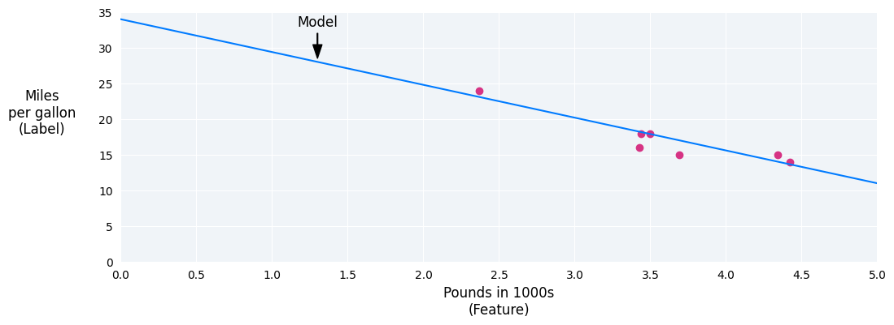
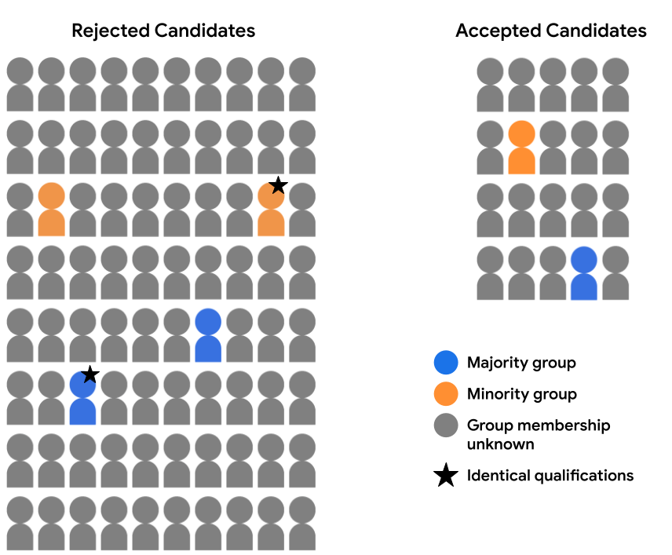

# Google Machine Learning Crash Course
https://developers.google.com/machine-learning/crash-course/

---

# Notes

## Intro to ML
- Supervised: regression, clustering
- Unsupervised: clustering

---

## Linear Regression

Linear regression is a statistical technique used to find the relationship between variables. In an ML context, linear regression finds the relationship between **features** and a **label**.



**Gradient descent** is an iterative process that finds the best weights and bias that minimise the loss.

**Hyperparameters** are variables that control different aspects of training. Three common hyperparameters are:
- Learning rate
- Batch size
- Epochs

In contrast, **parameters** are the variables, like the weights and bias, that are part of the model itself. In other words, hyperparameters are values that you control; parameters are values that the model calculates during training.

**Learning rate** is a floating point number you set that influences how quickly the model converges. If the learning rate is too low, the model can take a long time to converge. However, if the learning rate is too high, the model never converges, but instead bounces around the weights and bias that minimize the loss. The goal is to pick a learning rate that's not too high nor too low so that the model converges quickly.

**Batch size** is a hyperparameter that refers to the number of examples the model processes before updating its weights and bias.

Two common techniques to get the right gradient on average without needing to look at every example in the dataset before updating the weights and bias are stochastic gradient descent and mini-batch stochastic gradient descent:
- **Stochastic gradient descent** uses only a single example (a batch size of one) per iteration.
- **Mini-batch stochastic gradient descent** is a compromise between full-batch and SGD. For
number of data points, the batch size can be any number greater than 1 and less than
- The model chooses the examples included in each batch at random, averages their gradients, and then updates the weights and bias once per iteration.

An **epoch** means that the model has processed every example in the training set once. For example, given a training set with 1,000 examples and a mini-batch size of 100 examples, it will take the model 10 iterations to complete one epoch. In general, more epochs produces a better model, but also takes more time to train.

---

## Logistic Regression

The standard logistic function, also known as the sigmoid function (sigmoid means "s-shaped"), is used for classification and range from 0 to 1.

f(x) = 1/(1+e^(-x))

Transforming linear output using the sigmoid function:

z = b + w1x1 + w2x2 + ... + wNxN

z is the output of the linear equation, also called the log odds.
b is the bias.
The w values are the model's learned weights.
The x values are the feature values for a particular example.


Logistic regression models are trained using the same process as linear regression models, with two key distinctions:
- Logistic regression models use **Log Loss** as the loss function instead of squared loss.
- Applying **regularization** is critical to prevent overfitting.

Most logistic regression models use one of the following two strategies to decrease model complexity:
- **L2 regularisation**
- **Early stopping**: Limiting the number of training steps to halt training while loss is still decreasing.

---

## Classification

Binary classification means interpreting the logstic regression probability value as one category or another e.g. spam/not spam. This requires a threshold.

A confusion matrix is made up of TP, FP, TN, and FN.

When the total of actual positives is not close to the total of actual negatives, the dataset is imbalanced. An instance of an imbalanced dataset might be a set of thousands of photos of clouds, where the rare cloud type you are interested in, say, volutus clouds, only appears a few times.

Accuracy is the proportion of all classifications that were correct, whether positive or negative.

The true positive rate (TPR), or the proportion of all actual positives that were classified correctly as positives, is also known as recall.

The false positive rate (FPR) is the proportion of all actual negatives that were classified incorrectly as positives, also known as the probability of false alarm.

Precision is the proportion of all the model's positive classifications that are actually positive.

| Metric	| Guidance |
| --------- | ------------------- |
| Accuracy	| Use as a rough indicator of model training progress/convergence for balanced datasets. For model performance, use only in combination with other metrics. Avoid for imbalanced datasets. Consider using another metric. | 
| Recall (True positive rate) |	Use when false negatives are more expensive than false positives. | 
| False positive rate	| Use when false positives are more expensive than false negatives. | 
| Precision	| Use when it's very important for positive predictions to be accurate. | 

The ROC curve is a visual representation of model performance across all thresholds. The ROC curve is drawn by calculating the true positive rate (TPR) and false positive rate (FPR) at every possible threshold (in practice, at selected intervals), then graphing TPR over FPR. A perfect model, which at some threshold has a TPR of 1.0 and a FPR of 0.0, can be represented by either a point at (0, 1).


The area under the ROC curve (AUC) represents the probability that the model, if given a randomly chosen positive and negative example, will rank the positive higher than the negative. The perfect model above, containing a square with sides of length 1, has an area under the curve (AUC) of 1.0. For a binary classifier, a model that does exactly as well as random guesses or coin flips has a ROC that is a diagonal line from (0,0) to (1,1). The AUC is 0.5, representing a 50% probability of correctly ranking a random positive and negative example. AUC is a useful measure for comparing the performance of two different models, as long as the dataset is roughly balanced.

**Prediction bias** is the difference between the mean of a model's predictions and the mean of ground-truth labels in the data. 

Prediction bias can be caused by:
- Biases or noise in the data, including biased sampling for the training set
- Too-strong regularization, meaning that the model was oversimplified and lost some necessary complexity
- Bugs in the model training pipeline
- The set of features provided to the model being insufficient for the task

**Multi-class classification** can be treated as an extension of binary classification to more than two classes. For example, in a three-class multi-class classification problem, where you're classifying examples with the labels A, B, and C, you could turn the problem into two separate binary classification problems. First, you might create a binary classifier that categorizes examples using the label A+B and the label C. Then, you could create a second binary classifier that reclassifies the examples that are labeled A+B using the label A and the label B.

---

## Numerical Data

You must determine the best way to represent raw dataset values as trainable values in the feature vector. This process is called feature engineering, and it is a vital part of machine learning. The most common feature engineering techniques are:
- Normalization: Converting numerical values into a standard range.
- Binning (also referred to as bucketing): Converting numerical values into buckets of ranges.

Tip: to get basic stats, use pd.df.describe()
```
# https://pandas.pydata.org/pandas-docs/stable/reference/api/pandas.DataFrame.describe.html

DataFrame.describe(percentiles=None, include=None, exclude=None)

training_df.describe()
```

Normalization provides the following benefits:
- Helps models converge more quickly during training. 
- Helps models infer better predictions. 
- Helps avoid the "NaN trap" when feature values are very high. 
- Helps the model learn appropriate weights for each feature.

**Linear scaling** (more commonly shortened to just scaling) means converting floating-point values from their natural range into a standard range—usually 0 to 1 or -1 to +1. Use when:
- The lower and upper bounds of your data don't change much over time.
- The feature contains few or no outliers, and those outliers aren't extreme.
- The feature is approximately uniformly distributed across its range. That is, a histogram would show roughly even bars for most values.

x' = (x-xmin)(xmax-xmin)

**Z-score scaling**. A Z-score is the number of standard deviations a value is from the mean. Use when data follows a normal distribution.

x' = (x-u)/o

**Log scaling** computes the logarithm of the raw value. Use when:
- power law distribution
- Low values of X have very high values of Y.
- As the values of X increase, the values of Y quickly decrease. Consequently, high values of X have very low values of Y.

x' = ln(x)

**Clipping** is a technique to minimize the influence of extreme outliers. Set a maximum value threshold where anything over that theshold is equal to the maximum.
- If x > max, set x = max
- If x < min, set x = min

**Binning** (also called bucketing) is a feature engineering technique that groups different numerical subranges into bins or buckets. Binning is a good alternative to scaling or clipping when either of the following conditions is met:
- The overall linear relationship between the feature and the label is weak or nonexistent.
- When the feature values are clustered.


**Quantile bucketing** creates bucketing boundaries such that the number of examples in each bucket is exactly or nearly equal. Quantile bucketing mostly hides the outliers.

**Scrubbing** involves removing bad data or cleaning data due to:
- Omitted values	
- Duplicate examples	
- Out-of-range feature values.	
- Bad labels

Qualities of good numerical features
- Clearly named
- Checked or tested before training
- Sensible

When one variable is related to the square, cube, or other power of another variable, it's useful to create a synthetic feature from one of the existing numerical features. It's possible to keep both the linear equation and allow nonlinearity through **polynomial transforms**:

x = x2

y = b + w1x1 + w2x2

---

## Categorical data

**Encoding** means converting categorical or other data to numerical vectors that a model can train on. 

The term **dimension** is a synonym for the number of elements in a feature vector.

When a categorical feature has a low number of possible categories, you can encode it as a **vocabulary**. With a vocabulary encoding, the model treats each possible categorical value as a separate feature. During training, the model learns different weights for each category.

The next step in building a vocabulary is to convert each index number to its **one-hot encoding**. In a one-hot encoding:
- Each category is represented by a vector (array) of N elements, where N is the number of categories. For example, if car_color has eight possible categories, then the one-hot vector representing will have eight elements. \[0,1,0,0,0,0,0,0\]
- Exactly one of the elements in a one-hot vector has the value 1.0; all the remaining elements have the value 0.0.

A feature whose values are predominantly zero (or empty) is termed a **sparse feature**. Ordinal encoding (integer labels): \[1\]

You can lump outliers into a single "catch-all" category called **out-of-vocabulary (OOV)**.

**Embeddings** substantially reduce the number of dimensions, which benefits models in two important ways:
- The model typically trains faster.
- The built model typically infers predictions more quickly. That is, the model has lower latency.

**Hashing** (also called the hashing trick) is a less common way to reduce the number of dimensions.

Data manually labeled by human beings is often referred to as **gold labels**, and is considered more desirable than machine-labeled data for training models, due to relatively better data quality.

The difference between human raters' decisions is called **inter-rater agreement**. These can be measured through:
- Cohen's kappa and variants
- Intra-class correlation (ICC)
- Krippendorff's alpha

Machine-labeled data, where categories are automatically determined by one or more classification models, is often referred to as **silver labels**. 

Categorical data tends to produce **high-dimensional** feature vectors; that is, feature vectors having a large number of elements.

**Feature crosses** are created by crossing (taking the Cartesian product of) two or more categorical or bucketed features of the dataset. Feature crosses are somewhat analogous to Polynomial transforms. Both combine multiple features into a new synthetic feature that the model can train on to learn nonlinearities. Domain knowledge can suggest a useful combination of features to cross.

[Playground](https://playground.tensorflow.org/#activation=tanh&batchSize=10&dataset=circle&regDataset=reg-plane&learningRate=0.03&regularizationRate=0&noise=0&networkShape=4,2&seed=0.14938&showTestData=false&discretize=false&percTrainData=50&x=true&y=true&xTimesY=false&xSquared=false&ySquared=false&cosX=false&sinX=false&cosY=false&sinY=false&collectStats=false&problem=classification&initZero=false&hideText=false) is an interactive application that lets you manipulate various aspects of training and testing a machine learning model. 

---

## Datasets, generalisation, and overfitting

A dataset is a collection of examples.

Types of data
- numerical data
- categorical data
- human language
- multimedia
- outputs from other ML systems
- embedding vectors

Models trained on large datasets with few features generally outperform models trained on small datasets with a lot of features.

A high-quality dataset helps your model accomplish its goal. A low quality dataset inhibits your model from accomplishing its goal.

**Reliability** refers to the degree to which you can trust your data.

In measuring reliability, you must determine:
- How common are label errors?
- Are your features noisy?
- Is the data properly filtered for your problem?

The following are common causes of unreliable data in datasets:
- Omitted values	
- Duplicate examples	
- Bad feature values
- Bad labels
- Bad sections of data

Don't train a model on incomplete examples. Instead, fix or eliminate incomplete examples by doing one of the following:
- Delete incomplete examples
- Impute missing values

A good dataset tells the model which values are imputed and which are actual.

One common algorithm is to use the mean or median as the imputed value. 

Types of labels:
- **Direct labels**, which are labels identical to the prediction your model is trying to make.
- **Proxy labels**, which are labels that are similar

Human-generated data
| Advantages | Disadvantages |
| --- | --- |
| Human raters can perform a wide range of tasks that even sophisticated machine learning models may find difficult. | You typically pay human raters, so human-generated data can be expensive. |
| The process forces the owner of the dataset to develop clear and consistent criteria. | To err is human. Therefore, multiple human raters might have to evaluate the same data. |

In a **balanced** dataset, the number of Positive and Negative labels is about equal. However, if one label is more common than the other label, then the dataset is **imbalanced**. The predominant label in an imbalanced dataset is called the **majority class**; the less common label is called the **minority class**.

One way to handle an imbalanced dataset is to downsample and upweight the majority class. Here are the definitions of those two new terms:
- **Downsampling** (in this context) means training on a disproportionately low subset of the majority class examples.
- **Upweighting** means adding an example weight to the downsampled class equal to the factor by which you downsampled.

Upweighting the minority class tends to increase prediction bias.

Downsampling and upweighting majority class:
- Faster convergence
- Less disk space

Rebalancing ratio depends on:
- The batch size
- The imbalance ratio
- The number of examples in the training set

Split original dataset:
- A training set that the model trains on.
- A validation set performs the initial testing on the model as it is being trained.
- A test set for evaluation of the trained model.

In summary, a good test set or validation set meets all of the following criteria:
- Large enough to yield statistically significant testing results.
- Representative of the dataset as a whole.
- Representative of the real-world data that the model will encounter as part of its business purpose.
- Zero examples duplicated in the training set.

When the dataset contains too many examples, you must select a subset of examples for training. When possible, select the subset that is most relevant to your model's predictions.

Good datasets omit examples containing Personally Identifiable Information (PII).

**Overfitting** means creating a model that matches (memorizes) the training set so closely that the model fails to make correct predictions on new data. Causes:
- The training set doesn't adequately represent real life data (or the validation set or test set).
- The model is too complex.

An **underfit** model doesn't even make good predictions on the training data.

**Generalisation** is the opposite of overfitting. That is, a model that generalizes well makes good predictions on new data. Dataset conditions:
- Examples must be independently and identically distributed.
- The dataset is stationary, meaning the dataset doesn't change significantly over time.
- The dataset partitions have the same distribution.

The following curves help you detect overfitting:
- loss curves
- generalisation curves


Penalising complex models is one form of **regularisation**.

Your model should find a reasonable compromise between loss and complexity which are inversely related.

**L1 regularisation** accounts for the weights in a model whereas **L2 regularisation** accounts for the sqaure of the weights in a model.

**L2 regularisation** is a popular regularization metric, which uses the following formula:

L2 = w1^2 + w2^2 + ... + wn^2

L2 regularisation encourages weights toward 0, but never pushes weights all the way to zero.

Model developers tune the overall impact of complexity on model training by multiplying its value by a scalar called the **regularisation rate**:

minimise(loss + lambda*complexity)

A high regularization rate:
- Strengthens the influence of regularization, thereby reducing the chances of overfitting.
- Tends to produce a histogram of model weights having the following characteristics:
  - a normal distribution
  - a mean weight of 0.

A low regularization rate:
- Lowers the influence of regularization, thereby increasing the chances of overfitting.
- Tends to produce a histogram of model weights with a flat distribution.

Picking regularisation rate:
- Early stopping is a regularisation method that doesn't involve a calculation of complexity. Instead, early stopping simply means ending training before the model fully converges.
- Finding equilibrium between learning rate and regularization rate. Learning rate and regularisation rate tend to pull weights in opposite directions. A high learning rate often pulls weights away from zero; a high regularisation rate pulls weights towards zero.

Loss curves
| Issue | Fix |
| --- | --- |
| Oscilatting | Reduce training set, reduce learning rate, remove bad examples |
| Sharp jump | Remove NaNs and outliers |
| Divergance of train/test | Simplify model and increase regularisation rate, make sure both are representative datasets that are statistically equivalent |
| Gets stuck | Shuffle training set |

---

## Neural Network

Neural networks are a family of model architectures designed to find nonlinear patterns in data. During training of a neural network, the model automatically learns the optimal feature crosses to perform on the input data to minimize loss.

In neural network terminology, additional layers between the input layer and the output layer are called **hidden layers**, and the nodes in these layers are called **neurons**.

Parameters = Weights + Bias

Example: 3 input nodes, 4 hidden nodes, 1 output node
- Each hidden node has 4 parameters: 3 weights (from the inputs nodes) + bias
- Each output node has 5 parameters: 4 weights (from the hidden nodes) + bias
- Total number of parameters = 4\*4 + 5\*1 = 21

Linear calculations performed on the output of linear calculations are also linear, which means this model cannot learn nonlinearities.

**Activation function** = a nonlinear transform of a neuron's output value before the value is passed as input to the calculations of the next layer of the neural network

Three mathematical functions that are commonly used as activation functions are **sigmoid, tanh, and ReLU**.
- The Sigmoid function (1/(1+e^-x) outputs a value between 0 and 1
- The tanh(x) function outputs a value between -1 and 1
- The rectified linear unit activation function (max(0,x)) returns a value between 0 and inf

ReLU often works a little better as an activation function than a smooth function like sigmoid or tanh, because it is less susceptible to the **vanishing gradient problem** during neural network training. ReLU is also significantly easier to compute than these functions.

Vanishing gradient problem = The tendency for the gradients of early hidden layers of some deep neural networks to become surprisingly flat (low). Increasingly lower gradients result in increasingly smaller changes to the weights on nodes in a deep neural network, leading to little or no learning. Models suffering from the vanishing gradient problem become difficult or impossible to train. **Long Short-Term Memory** (LSTM) cells address this issue.

LSTM = A type of cell in a **recurrent neural network** (RNN) used to process sequences of data in applications such as handwriting recognition, machine translation, and image captioning. LSTMs address the vanishing gradient problem that occurs when training RNNs due to long data sequences by maintaining history in an internal memory state based on new input and context from previous cells in the RNN.

**Backpropagation** is the most common training algorithm for neural networks. It makes gradient descent feasible for multi-layer neural networks. Many machine learning code libraries (such as Keras) handle backpropagation automatically, so you don't need to perform any of the underlying calculations yourself. The backpropagation training algorithm makes use of the calculus concept of a gradient to adjust model weights to minimise loss

**Vanishing gradients** = The gradients for the lower neural network layers (those closer to the input layer) can become very small. In deep networks (networks with more than one hidden layer), computing these gradients can involve taking the product of many small terms. The ReLU activation function can help prevent vanishing gradients.

**Exploding gradients** = If the weights in a network are very large, then the gradients for the lower layers involve products of many large terms. In this case you can have exploding gradients: gradients that get too large to converge. **Batch normalisation** can help prevent exploding gradients, as can lowering the learning rate.

**Dead ReLU Units** = Once the weighted sum for a ReLU unit falls below 0, the ReLU unit can get stuck. It outputs 0, contributing nothing to the network's output, and gradients can no longer flow through it during backpropagation. With a source of gradients cut off, the input to the ReLU may not ever change enough to bring the weighted sum back above 0. Lowering the learning rate can help keep ReLU units from dying.

**Dropout Regularisation** = It works by randomly "dropping out" unit activations in a network for a single gradient step. The more you drop out, the stronger the regularisation:
- 0.0 = No dropout regularization.
- 1.0 = Drop out all nodes. The model learns nothing.
- Values between 0.0 and 1.0 = More useful.

**One-vs.-all** provides a way to use binary classification for a series of yes or no predictions across multiple possible labels. Given a classification problem with N possible solutions, a one-vs.-all solution consists of N separate binary classifiers—one binary classifier for each possible outcome. During training, the model runs through a sequence of binary classifiers, training each to answer a separate classification question. In a one-vs.-all approach, the probability of each binary set of outcomes is determined independently of all the other sets.


For one-vs.-all, we applied the sigmoid activation function to each output node independently, which resulted in an output value between 0 and 1 for each node, but did not guarantee that these values summed to exactly 1.

For one-vs.-one, we can instead apply a function called **softmax**, which assigns decimal probabilities to each class in a multi-class problem such that all probabilities add up to 1.0. This additional constraint helps training converge more quickly than it otherwise would. In order to perform softmax, the hidden layer directly preceding the output layer (called the softmax layer) must have the same number of nodes as the output layer.


**Full softmax** is the softmax we've been discussing; that is, softmax calculates a probability for every possible class.

**Candidate sampling** means that softmax calculates a probability for all the positive labels but only for a random sample of negative labels. 

Softmax must only be used when each example is a member of exactly 1 class. Otherwise **multiple logistic regressions** should be used.

---

## Embeddings

Pitfalls of sparse data representations (one-hot vectors)
- Number of weights
- Number of datapoints
- Amount of computation
- Amount of memory
- Difficulty of supporting on-device machine learning (ODML)

An **embedding** is a vector representation of data in embedding space. An embedding represents each item in n-dimensional space with n floating-point numbers (typically in the range –1 to 1 or 0 to 1). Generally speaking, a model finds potential embeddings by projecting the high-dimensional space of initial data vectors into a *lower-dimensional* space.


In the real world, embedding spaces are d-dimensional, where d is much higher than 3. However, d will be lower than the dimensionality of the data, and relationships between data points are not necessarily intuitive. For word embeddings, d is often 256, 512, or 1024.

Real world examples
- Genomic sequencies of simple viruses: genome vs nucleotide
- Photos of horses: number of pixels, sharpes, colours, patterns
- Lines of code: length, class, type

**word2vec** trains on a corpus of documents to obtain a single global embedding per word. When each word or data point has a single embedding vector, this is called a **static embedding**.

Fun widget to try out: [Embedding projector](https://projector.tensorflow.org/)
- flattens 10,000 word2vec static vectors into a 3D space
- The pre-trained word vectors offered by word2vec were in fact trained on Google News articles up to 2013
- MNIST: A public-domain dataset compiled by LeCun, Cortes, and Burges containing 60,000 images, each image showing how a human manually wrote a particular digit from 0–9. Each image is stored as a 28x28 array of integers, where each integer is a grayscale value between 0 and 255, inclusive.

**Principal component analysis (PCA)** has been used to create word embeddings. Given a set of instances like bag of words vectors, PCA tries to find highly correlated dimensions that can be collapsed into a single dimension.

In general, you can create a hidden layer of size d in your neural network that is designated as the **embedding layer**, where d represents both the number of nodes in the hidden layer and the number of dimensions in the embedding space.

**Contextual embeddings** allow a word to be represented by multiple embeddings that incorporate information about the surrounding words as well as the word itself. E.g. orange colour, orange fruit. Contextual embeddings encode positional information, while static embeddings do not. One token is represented by one static embedding, but can be represented by multiple contextual embeddings.

Some methods for creating contextual embeddings, like ELMo, take the static embedding of an example, such as the word2vec vector for a word in a sentence, and transform it by a function that incorporates information about the words around it. For ELMo models specifically, the static embedding is aggregated with embeddings taken from other layers, which encode front-to-back and back-to-front readings of the sentence.

BERT models mask part of the sequence that the model takes as input.

---

## Large Language Models

A **language model** estimates the probability of a **token** or sequence of tokens occurring within a longer sequence of tokens. A token could be a word, a subword (a subset of a word), or even a single character.

**Tokenisation** is language specific, so the number of characters per token differs across languages. For English, one token corresponds to ~4 characters or about 3/4 of a word, so 400 tokens ~= 300 English words.

Tokens are the atomic unit or smallest unit of language modeling.

Tokens are now also being successfully applied to computer vision and audio generation.

Uses of language models:
- Fill in blanks
- Generate text
- Translate text
- Summarise documents

**N-grams** are ordered sequences of words used to build language models, where N is the number of words in the sequence. Longer N-grams would certainly provide more context than shorter N-grams. However, as N grows, the relative occurrence of each instance decreases. When N becomes very large, the language model typically has only a single instance of each occurrence of N tokens, which isn't very helpful in predicting the target token.

**Recurrent neural networks** provide more context than N-grams. A recurrent neural network is a type of neural network that trains on a sequence of tokens. Although recurrent neural networks learn more context than N-grams, the amount of useful context recurrent neural networks can intuit is still relatively limited. Recurrent neural networks evaluate information "token by token." In contrast, large language models—the topic of the next section—can evaluate the whole context at once.

**Large language models (LLMs)** predict a token or sequence of tokens, sometimes many paragraphs worth of predicted tokens. LLMs are better than N-gram language models because:
- LLMs contain far more parameters than recurrent models.
- LLMs gather far more context.

**Transformers** are the state-of-the-art architecture for a wide variety of language model applications, such as translation.

Full transformers consist of an encoder and a decoder:
- An **encoder** converts input text into an intermediate representation. An encoder is an enormous neural net.
- A **decoder** converts that intermediate representation into useful text. A decoder is also an enormous neural net.


Encoder-only architectures map input text into an intermediate representation (often, an embedding layer). 

Decoder-only architectures generate new tokens from the text already generated.

To enhance context, Transformers rely heavily on a concept called **self-attention**. This weighs the importance of relations between tokens in the input sequence.
- Some self-attention mechanisms are **bidirectional**, meaning that they calculate relevance scores for tokens preceding and following the word being attended to.
- By contrast, a **unidirectional** self-attention mechanism can only gather context from words on one side of the word being attended to.
- Encoders use bidirectional self-attention, while decoders use unidirectional

Each self-attention layer is typically comprised of multiple **self-attention heads**. 

A complete transformer model stacks multiple **self-attention layers** on top of one another. 

Transformers contain multiple self-attention layers and multiple self-attention heads per self-attention layer, so Big O is:

O(N2 · S · D)

How LLMS are trained:
- The first phase of training is usually some form of unsupervised learning on that training data.
- Specifically, the model trains on masked predictions, meaning that certain tokens in the training data are intentionally hidden.
- The model trains by trying to predict those missing tokens.
- An LLM is just a neural net, so loss (the number of masked tokens the model correctly considered) guides the degree to which backpropagation updates parameter values.
- A Transformer-based model trained to predict missing data gradually learns to detect patterns and higher-order structures in the data to get clues about the missing token.
- An optional further training step called instruction tuning can improve an LLM's ability to follow instructions.

Transformers contain hundreds of billion or even trillions of parameters.

Benefits:
- LLMs can generate clear, easy-to-understand text for a wide variety of target audiences.
- LLMs can make predictions on tasks they are explicitly trained on.
- Some researchers claim that LLMs can also make predictions for input they were not explicitly trained on, but other researchers have refuted this claim.

Problems
- Gathering an enormous training set.
- Consuming multiple months and enormous computational resources and electricity.
- Solving parallelism challenges.
- LLMs hallucinate, meaning their predictions often contain mistakes.
- LLMs consume enormous amounts of computational resources and electricity.
- Like all ML models, LLMs can exhibit all sorts of bias.

General-purpose LLMs:
- foundation LLMs: grammar, words, idioms, poetry, not regression/classification, platform rather than solution, needs fine-tuning & distillation
- base LLMs
- pre-trained LLMs

**Fine-tuning**
- Additional training (not extra parameters)
- Specific examples
- Computationally expensive
- Update weight & bias on each backpropagation iteration
- **Parameter-efficient tuning**: adjust only a subset of parameters

**Distillation**
- Smaller version of LLM (fewer parameters)
- Faster & fewer computational/enviro resources
- Not as good as original LLM's predictions
- Bulk inference to label data
- Teacher model (larger) funnels knowledge to Student model (smaller)

**Prompt engineering** enables an LLM's end users to customise the model's output. 
- Showing one example to an LLM is called **one-shot prompting**.
- Providing multiple examples is called **few-shot prompting**.

The number of parameters in an LLM is sometimes so large that **online inference** is too slow to be practical for real-world tasks like regression or classification. Consequently, many engineering teams rely on **offline inference** (also known as bulk inference or static inference) instead. In other words, rather than responding to queries at serving time, the trained model makes predictions in advance and then caches those predictions.

Like any form of machine learning, LLMs generally share the biases of:
- The data they were trained on.
- The data they were distilled on.

---

## Production ML systems

You can train a model in either of two ways:
- **Static training** (also called offline training) means that you train a model only once. 
- **Dynamic training** (also called online training) means that you train a model continuously or at least frequently.

| | Static | Dynamic |
| --- | --- | --- |
| **Advantages** | Simpler and cheaper | More adaptable |
| **Disadvantages** | Sometimes staler | More work |

**Inference** is the process of making predictions by applying a trained model to unlabeled examples. 
- **Static inference** (also called offline inference or batch inference) means the model makes predictions on a bunch of common unlabeled examples and then caches those predictions somewhere. Good for models that take a long time to make predictions and require cache.
- **Dynamic inference** (also called online inference or real-time inference) means that the model only makes predictions on demand, for example, when a client requests a prediction. Good for models that make quick predictions.

| | Static | Dynamic |
| --- | --- | --- |
| **Advantages** | Cheaper and can do post-verification | Can infer a prediction on any new item |
| **Disadvantages** | Can only serve cached predictions and takes hours/days to update | Compute intensive and latency sensitive, monitoring intensive |

Raw data must be **feature engineered** (transformed). This can be done before or while training the model.

| | Before | After |
| --- | --- | --- |
| **Advantages** | Transform data once and analyse the entire datase |  Can still use the same raw data files if you change the transformations and ensured the same transformations at training and prediction time. |
| **Disadvantages** | Must recreate the transformations at prediction time. Beware of training-serving skew! |  Increase model latency and transform each batch |

**Training-serving skew** is more dangerous when your system performs dynamic (online) inference. On a system that uses dynamic inference, the software that transforms the raw dataset usually differs from the software that serves predictions, which can cause training-serving skew. Training-serving skew means your input data during training differs from your input data in serving.

| Type |	Definition |	Example |	Solution |
| --- | --- | --- | --- |
| **Schema skew** | Training and serving input data do not conform to the same schema. | The format or distribution of the serving data changes. | Use the same schema to validate training and serving data. Check statistics. |
| **Feature skew** | Engineered data differs between training and serving. | Feature engineering code differs between training and serving. | Apply statistical rules across training and serving engineered data. Number/ratio of skewed features. |

Transforming the data per batch: precompute the mean and standard deviation across the entire dataset and then use them as constants in the model (Z-score normalisation).

Deployment Testing
- **Test-driven development**: discover the achievable loss during model development and then test new model versions against the achievable loss
- Seed the random number generator
- Initialise model components in a fixed order
- Take the average of several runs of the model
- Use version control
- API testing: write a **unit test** to generate random input data and run a single step of gradient descent
- Check that components work together by writing an **integration test** that runs the entire pipeline end-to-end
- **Sudden degradation**: bug in the new version could cause significantly lower quality.
- **Slow degradation**: ensure your model's predictions on a validation dataset meet a fixed threshold
- Ensure that the operations used by the model are present in the server by staging the model in a sandboxed version of the server to avoid different software dependencies before updating the server

Data schema
- Understand the range and distribution of your features.
- Encode your understanding into the data schema.
- Test your data against the data schema.

Write unit tests based on your understanding of feature engineered data. 

**Data slices** = subsets of data. Compare model metrics for these data slices against the metrics for your entire dataset to remove bias.

To measure real-world impact, you need to define separate metrics (survey).

**Label leakage** means that your **ground truth labels** that you're trying to predict have inadvertently entered your training features. Label leakage is sometimes very difficult to detect. Label leakage is when information that is not available at the time of prediction leaks into the training set used for model training.

Monitor model age throughout pipeline: old models might not perform as well.

Test that model weights and outputs are numerically stable: weights and layer outputs should not be NaN (not a number) or Inf (infinite).

Monitor model performance
- Track model performance by versions of code, model, and data.
- Test the training steps per second for a new model version against the previous version and against a fixed threshold.
- Catch memory leaks by setting a threshold for memory use.
- Monitor API response times and track their percentiles.
- Monitor the number of queries answered per second.

Test the quality of live model on served data
- Generate labels using human raters.
- Investigate models that show significant statistical bias in predictions.
- Track real-world metrics for your model.
- Mitigate potential divergence between training and serving data by serving a new model version on a fraction of your queries

Randomisation (reproducibility)
- Seed your **random number generators** (RNGs).
- Use invariant hash keys. **Hashing** is a common way to split or sample data. Hashing is a good way to map large categorical sets into the selected number of buckets. Hashing turns a categorical feature having a large number of possible values into a much smaller number of values by grouping values in a deterministic way.

Considerations for hashing
- When using hashing to include or exclude queries:
  - Your training set will see a less diverse set of queries.
  - Your evaluation sets will be artificially hard, because they won't overlap with your training data.
- Instead you can hash on query + date, which would result in a different hashing each day.


Questions to ask
- Is each feature helpful?
- Is your data source reliable?
- Is your model part of a feedback loop? (This can affect dynamic training as the model will affect the input data)

---

## Automated Machine Learning (AutoML)

Manual ML workflow:
- Repetitive tasks
- Specialised Skills


AutoML is useful for speeding up repetitive tasks:
- Data Engineering
  - Feature engineering.
  - Feature selection.
- Training
  - Identifying an appropriate ML algorithm.
  - Selecting the best hyperparameters.
- Analysis
  - Evaluating metrics generated during training based on test and validation datasets.
 
| Benefits | Limitations |
| --- | --- |
| Save time | Models can't be customised during training |
| Improve quality of model | Quality not as good as manual training |
| No need for specialised skils | Model search and complexity can be opaque |
| Smoke test a dataset | Multiple AutoML runs may show more variance |
| Evaluate a dataset | |
| Enforce best practices | |
| Less data needed with transfer learning | |

**Transfer learning** might involve transferring knowledge from the solution of a simpler task to a more complex one, or involve transferring knowledge from a task where there is more data to one where there is less data.

AutoML tools fall into two main categories:
- Tools that require no coding
- API and CLI tools: advanced automation features, more programming required

AutoML workflow
- Problem definition
- Data gathering
- Data preparation
  - Label data
  - Clean and format data
  - Perform feature transformations

Model development (with a no-code AutoML)
 1. Import data
 2. Analyse data
 3. Refine data
   - Semantic checking: type of data, categorical, continuous
   - Transformations: e.g. get length of description or comments
 4. Configure AutoML run parameters
   - ML problem type: classifcation, regression
   - Select column of labels
   - Select the set of features to use to train the model
   - Select the set of ML algorithms
   - Select the evaluation metric

Evaluate model
- Examine feature importance metrics
- Examine architecture and hyperparameters
- Evaluate top-level model performance with plots and metrics

Productisation
- Test and deploy model

Retrain model
- Improved dataset

---

## Fairness

There are over 100 types of bias.

**Reporting bias** occurs when the frequency of events, properties, and/or outcomes captured in a dataset does not accurately reflect their real-world frequency. E.g. most memorable events are reported.

**Historical bias** occurs when historical data reflects inequities that existed in the world at that time.

**Automation bias** is a tendency to favor results generated by automated systems over those generated by non-automated systems, irrespective of the error rates of each.

**Selection bias** occurs if a dataset's examples are chosen in a way that is not reflective of their real-world distribution. Selection bias can take many different forms, including coverage bias, non-response bias, and sampling bias.
- **Coverage bias** occurs if data is not selected in a representative fashion.
- **Non-response bias** (also known as participation bias) occurs if data ends up being unrepresentative due to participation gaps in the data-collection process.
- **Sampling bias occurs** if proper randomisation is not used during data collection.

**Group attribution bias** is a tendency to generalize what is true of individuals to the entire group to which they belong. 
- **In-group bias** is a preference for members of your own group you also belong, or for characteristics that you also share.
- **Out-group homogeneity bias** is a tendency to stereotype individual members of a group to which you do not belong, or to see their characteristics as more uniform.

**Implicit bias** occurs when assumptions are made based on one's own model of thinking and personal experiences that don't necessarily apply more generally.

**Confirmation bias** occurs when model builders unconsciously process data in ways that affirm pre-existing beliefs and hypotheses.

**Experimenter's bias** occurs when a model builder keeps training a model until it produces a result that aligns with their original hypothesis.

Identifying bias
- Missing feature values
- Unexpected feature values
- Data skew

Mitigating bias
- Augmenting the training data.
- Adjusting the model's loss function.

The TensorFlow Model Remediation Library provides utilities for applying two different bias-mitigation techniques during model training:
- **MinDiff** aims to balance the errors for two different slices of data (male/female students versus nonbinary students) by adding a penalty for differences in the prediction distributions for the two groups.
- **Counterfactual Logit Pairing (CLP)** aims to ensure that changing a sensitive attribute of a given example doesn't alter the model's prediction for that example. E.g. if feature values are the same but gender is different, penalty for different predictions.
- MinDiff penalises differences in the overall distribution of predictions for different slices of data, whereas CLP penalises discrepancies in predictions for individual pairs of examples.

Evaluating for bias
- **Demographic parity**
- **Equality of opportunity**
- **Counterfactual fairness**

Demographic parity
- A fairness metric that is satisfied if the results of a model's classification are not dependent on a given sensitive attribute.
- both majority and minority groups are represented
- does not take the distribution of predictions for each demographic group
- E.g. students from minority/majority demographics are accepted at the same rate %


Equality of opportunity
- A fairness metric to assess whether a model is predicting the desirable outcome equally well for all values of a sensitive attribute.
- Equality of opportunity is related to equalised odds, which requires that both the true positive rates and false positive rates are the same for all groups.
- allows the model's ratio of positive to negative predictions to vary across demographic groups, provided that the model is equally successful at predicting the preferred label for both groups
- It's possible for a model's predictions to satisfy both demographic parity and equality of opportunity.
- designed for use cases where there is a clear-cut preferred label
- assesses fairness by comparing error rates in aggregate for demographic groups which may not always be feasible
- E.g. *qualified* students from minority/majority demographics are accepted at the same rate %


Counterfactual fairness
- Counterfactual fairness stipulates that two examples that are identical in all respects, except a given sensitive attribute (here, demographic group membership), should result in the same model prediction.
- E.g. you only have demographic info for two samples
- evaluate predictions for fairness in many cases where using other metrics wouldn't be feasible
- identify bias issues
- doesn't provide as holistic a view of bias in model predictions
- reccommend: aggregate fairness analysis (using a metric like demographic parity or equality of opportunity) as well as a counterfactual fairness analysis to gain the widest range of insights into potential bias issues in need of remediation



Incompatibility of fairness metrics
- The idea that some notions of fairness are mutually incompatible and cannot be satisfied simultaneously.
- As a result, there is no single universal metric for quantifying fairness that can be applied to all ML problems.

---

## Badges


