# Clustering
## What is clustering?
- find patterns and similarities in the dataset
- unsupervised ML
- unlabeled examples
- similarity measure
- each group is assigned a unique label called a cluster ID

## Clustering use cases
- Market segmentation
- Social network analysis
- Search result grouping
- Medical imaging
- Image segmentation
- Anomaly detection

### Other terminology
- Imputation: Missing data can be inferred from other data
- Data compression: The relevant cluster ID can replace other features - reduce number of features and resources needed
- Privacy presentation: Cluster users and associate user data with cluster IDs instead of user IDs

## CLustering algorithms
- k-means algorithm: complexity of O(n) meaning that the algorithm scales with n
- Centroid-based clustering: non-hierachial clusters, sensitive to ouliers, k-means
- Density-based clustering: connects contiguous areas of high example density into clusters
- Distribution-based clustering: probablistic distributions, Gaussian
- Hierachial clustering: tree, taxonomies

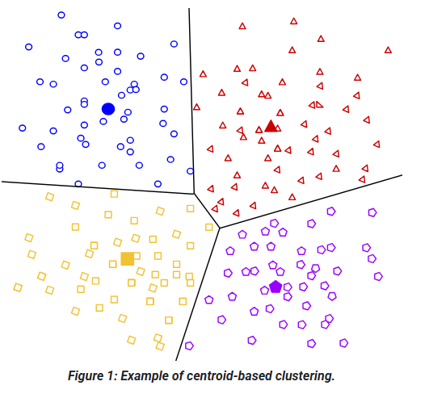

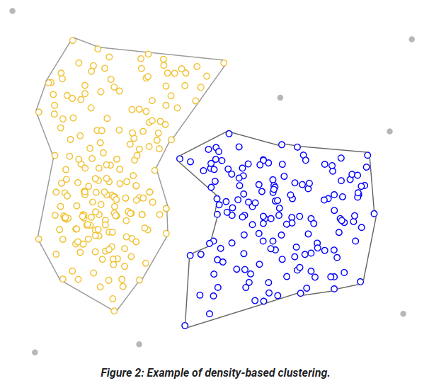

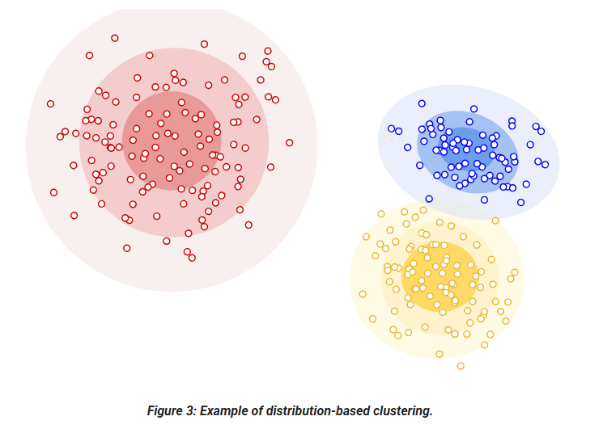

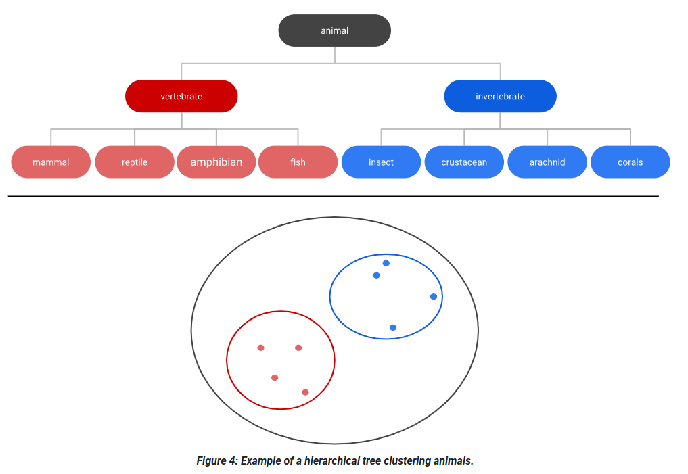

## Clustering workflow
- Prepare data: normalize, scale, and transform feature data
- Create similarity metric
- Run clustering algorithm: k-means
- Interpret results and adjust clustering

## Data preparation
- Normalising data: calculate Z-scores for Gaussian distribution (normal distribution)
- Log transforms for power law distribution (positive skew)
- Quantiles for sparse distribution

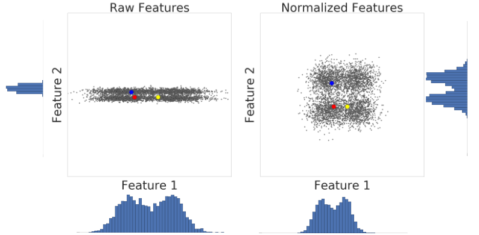

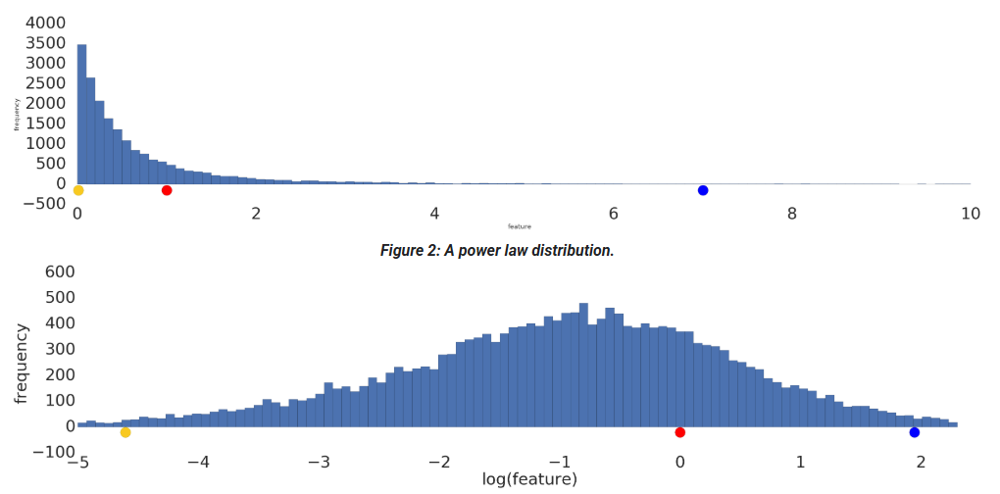

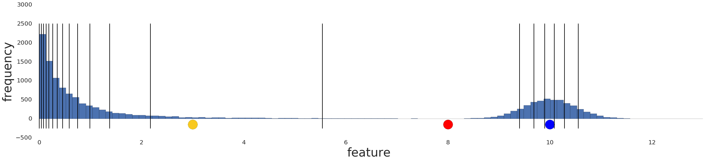

---

## K-means clustering
- Agglomerative hierarchial clustering complexity is O(n^2 log n)
- Divisive hierachial clustering complexity is O(n^2)
- k-means complexity is O(nk)

### Steps
- Provide initial guess for k
- Randomly choose k centroids
- Assign each point to nearest centroid
- Assign new centroid: mean of clusters
- Reassign each point to nearest centroid
- Repeat until no changes (convergence)

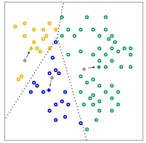

### Manual simlilarity measure
- Compare features using root mean squared error (RMSE)
- Categorical data more difficult: single-valued (univalent), multi-valued (multivalent)
- Can use Jaccard similarity for categorical data
- Ideally you would convert strings into numbers and calculate Euclidean distance
- Can use supervised similarity measure instead

### Evaluating results
- No ground truth available
- Assess quality of clustering: cardinality (number of samples per cluster), magnitude (sum of distances from centroid in cluster), downstream performance
- Magnitude versus cardinality: linear relationship - can spot outliers
- Reassess your similarity measure: identify pairs of examples known to be more or less similar, should be representative
- Find optimal number of clusters: k (number of clusters) vs magnitude (loss) - inverse relationship

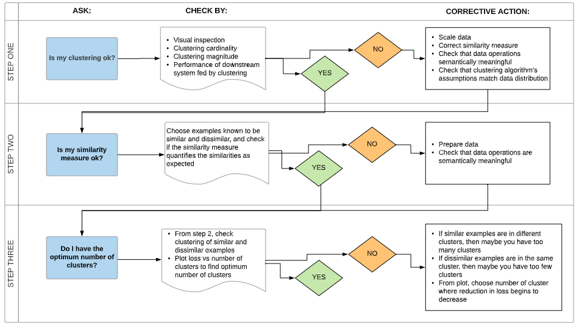

### Advantages of k-means
- Simple
- Scalable
- Converges
- Warm-starting of centroid positions
- Adapts to new examples
- Generalised to clusters of different shapes and sizes e.g. elliptical clusters

### Disadvantages
- k must be chosen manually
- Results depend on initial values
- Difficulty clustering data of varying sizes and densities without generalisation
- Difficulty clustering outliers
- Difficulty scaling with number of dimensions

### Curse of dimensionality and spectral clustering
- As dimensions increase, the standard deviation in distance between examples shrinks 
- Solution: spectral clustering
  - Reduce dimensionality of feature data by PCA
  - Project all data points into lower-dimensional subspace
  - Cluster data in subspace using chosen algorithm
 
---

## Supervised similarity measure
-  reduce the feature data to representations called embeddings
-  Embeddings are generated by training a supervised deep neural network (DNN)
-  map the feature data to a vector in an embedding space
-  A supervised similarity measure uses this "closeness" to quantify the similarity for pairs of examples

|Requirement|Manual|Supervised|
|---|---|---|
| Eliminates redundant info| No | Yes |
| Gives insight into calculated similarities | Yes | No |
| Suitable for small datasets | Yes | No |
| Large datasets | No | Yes |

## Creating a supervised similarity measure
- Input feature data
- Choose DNN: auto-encoder, predictor
- Extract embeddings
- Choose measurement: Dot product, Cosine, Euclidean distance

## Choose DNN based on training labels
- Reduce feature data to lower-dimensional embeddings
- Same feature data as input and labels
- Autoencoder: Learns embeddings of input data by predicting input data
- Predictor: predicts specific input features instead of all (some features may be more important than others)

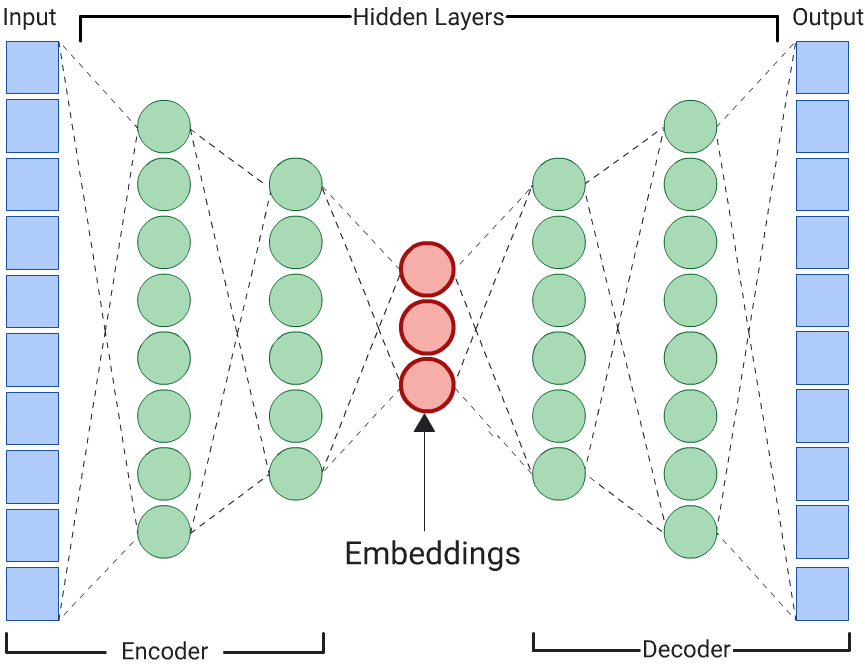

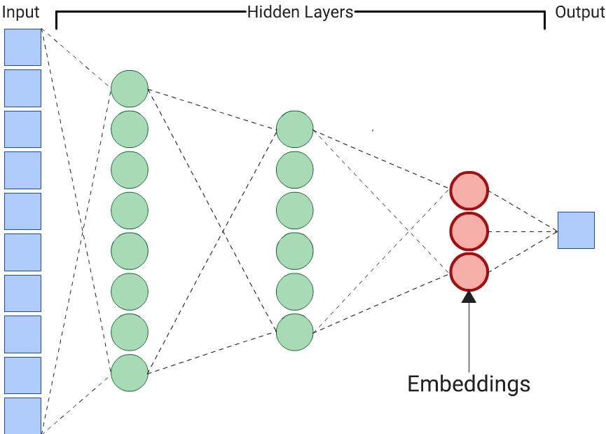

## Measuring similarity from embeddings
|Measure|Meaning|As similarity increases, this measure...|
|---|---|---|
|Euclidean distance|Distance between ends of vectors|Decreases|
|Cosine|Cosine of angle between vectors|Increases|
|Dot product|Cosine multiplied by lengths of both vectors|Increases|

## Choosing a similarity measure
-  Dot product is proportional to the vector length: capture popularity
-  However, may skew the similarity metric
