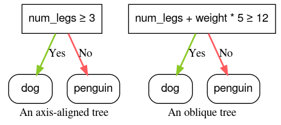
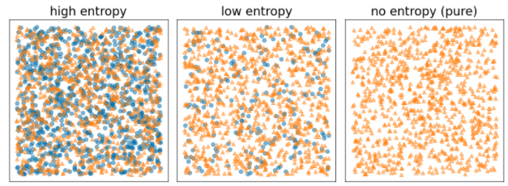

# Decision Forests
## https://developers.google.com/machine-learning/decision-forests?_gl=1*14s884u*_up*MQ..*_ga*NzM1NzgxNTgxLjE3NjgyMDgyMzI.*_ga_SM8HXJ53K2*czE3NjgyMDgyMzIkbzEkZzAkdDE3NjgyMDgyMzIkajYwJGwwJGgw

---

## Introduction
Benefits:
- Easier to configure than NN
- Fewer hyperparameters
- Good defaults
- Natively handle numeric, categorical, and missing features
- Good results out of the box
- Infer and train on small datasets
- Faster than NN

Algorithms:
- Classification
- Regression
- Ranking
- Anomaly detection
- Uplift modeling

## Appropriate data
- Tabular data
- Perform preprocessing like feature normalization or one-hot encoding
- Perform imputation (for example, replacing a missing value with -1)
- Small datasets

---

## Model
- Decision trees
- Python package YDF: CartLearner
- Scikit-Learn: from sklearn.ensemble import RandomForestClassifier
- R: library(randomForest)
- Questions: condition, split, test
- Root
- Nodes
- Inference path: visited nodes

## Types of conditions
- Axis-aligned: Single feature e.g. num_legs ≥ 2
- Oblique: multiple features e.g. num_legs ≥ num_fingers
- Oblique splits sometime produce better results at the expense of higher training and inference costs

## Binary vs Non-binary conditions
- Binary: two outcomes
- Non-binary: more than two outcomes
- Threshold condition: feature >= threshold

---

## Growing Decision Trees
- Optimal training: NP-hard problem which is a computational problem that is at least as difficult as the hardest problems in the NP (Nondeterministic Polynomial time) class
- greedy divide and conquer strategy
- At each node, all the possible conditions are evaluated and scored
- condition with the highest score
- Splitter: The routine responsible for finding the best condition is called the splitter (bottleneck when training)
- Score maximised by splitter depends on: information gain, Gini, MSE
- Algorithms: types of features, task, types of condition, regularisation criteria

## Exact splitter for binary classification with numerical features
- feature >= t
- Binary classification task
- Without missing values in the examples
- Without precomputed index on the examples
- Shannon entropy is a measure of disorder
- Shannon entropy is at a maximum when the labels in the examples are balanced (50% blue and 50% orange).
- Shannon entropy is at a minimum (value zero) when the labels in the examples are pure (100% blue or 100% orange).
- Information gain: differnet in entropy
- If time complexity of the splitter algorithm is O(n log n) then according to the master theorem, the time complexitiy of training a decision tree is O(mn log^2 n)

