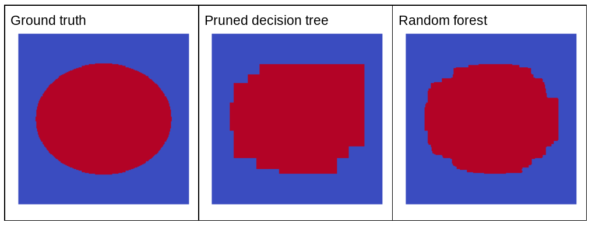
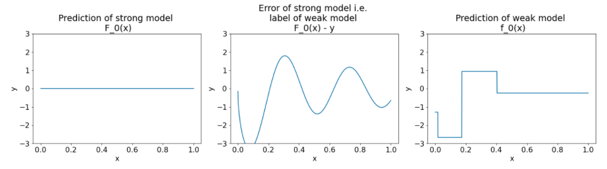

# Decision Forests
## https://developers.google.com/machine-learning/decision-forests?_gl=1*14s884u*_up*MQ..*_ga*NzM1NzgxNTgxLjE3NjgyMDgyMzI.*_ga_SM8HXJ53K2*czE3NjgyMDgyMzIkbzEkZzAkdDE3NjgyMDgyMzIkajYwJGwwJGgw

---

## Introduction
Benefits:
- Easier to configure than NN
- Fewer hyperparameters
- Good defaults
- Natively handle numeric, categorical, and missing features
- Good results out of the box
- Infer and train on small datasets
- Faster than NN
- Easily interpretable

Algorithms:
- Classification
- Regression
- Ranking
- Anomaly detection
- Uplift modeling

## Appropriate data
- Tabular data
- Perform preprocessing like feature normalization or one-hot encoding
- Perform imputation (for example, replacing a missing value with -1)
- Small datasets

---

## Model
- Decision trees
- Python package YDF (Yggdrasil Decision Forest): CartLearner (Classification and Regression Trees)
- Scikit-Learn: from sklearn.ensemble import RandomForestClassifier
- Tensorflow: tfdf.keras.CartModel, tfdf.keras.RandomForestModel
- R: library(randomForest)
- Questions: condition, split, test
- Root
- Nodes
- Inference path: visited nodes

## Types of conditions
- Axis-aligned: Single feature e.g. num_legs ≥ 2
- Oblique: multiple features e.g. num_legs ≥ num_fingers
- Oblique splits sometime produce better results at the expense of higher training and inference costs

## Binary vs Non-binary conditions
- Binary: two outcomes
- Non-binary: more than two outcomes
- Threshold condition: feature >= threshold

---

## Growing Decision Trees
- Optimal training: NP-hard problem which is a computational problem that is at least as difficult as the hardest problems in the NP (Nondeterministic Polynomial time) class
- greedy divide and conquer strategy
- At each node, all the possible conditions are evaluated and scored
- condition with the highest score
- Splitter: The routine responsible for finding the best condition is called the splitter (bottleneck when training)
- Score maximised by splitter depends on: information gain, Gini, MSE
- Algorithms: types of features, task, types of condition, regularisation criteria

## Exact splitter for binary classification with numerical features
- feature >= t
- Binary classification task
- Without missing values in the examples
- Without precomputed index on the examples
- *Shannon entropy* is a measure of disorder
- Shannon entropy is at a maximum when the labels in the examples are balanced (50% blue and 50% orange).
- Shannon entropy is at a minimum (value zero) when the labels in the examples are pure (100% blue or 100% orange).
- Information gain: differnce in entropy
- If time complexity of the splitter algorithm is O(n log n) then according to the master theorem, the time complexitiy of training a decision tree is O(mn log^2 n)

## Overfitting and pruning
- Noise in data can lead to overfitting
- Set a maximum depth to limit the growth of the decision tree - decrease to reduce overfitting
- Set a minimum number of examples in leaf (min_examples) - increase to reduce overfitting
- Remove (prune) branches after to improve quality of model with validation set (validation_ratio)

## Variable importances
- Score that indicates how "important" a feature is to the model
- The sum of the split score with a given variable.
- The number of nodes with a given variable.
- The average depth of the first occurrence of a feature across all the tree paths
- Differ by semantics, scale, and properties
- Provide info about the model, the dataset, and the training process

---

## Improve model hyperparameters
- Use more powerful learner: random forest, gradient boosted trees
- Optimise hyperparameter (manual)
- Hyperparameter tuning (automatic)

## Limitations
- Simple decision trees like CART aren't as good as RF or gradient boosted trees or NN

## Benefits
- As a simple and inexpensive baseline to evaluate more complex approaches.
- When there is a tradeoff between the model quality and interpretability.
- As a proxy for the interpretation of the decision forests model

---

## Decision Forests
- Models made of multiple decision trees
- multi-class classification random forest: most represented class
- gradient boosted Tree (GBT): sum of logits followed by activation function

## Random Forest (RF)
-  Ensemble: collection of models whose predictions are averaged
-  ideally the individual models should be independent
-  balance between model independence and the quality of its sub-models
-  RF: ensemble of decision trees in which each decision tree is trained with a specific random noise
-  *Bagging* (bootstrap aggregating) means training each decision tree on a random subset of the examples in the training set
-  Reuse of examples is called training "with replacement" (bootstrap_training_dataset)
-  *Attribute sampling* means that instead of looking for the best condition over all available features, only a random subset of features are tested at each node
-  *Pure* random forests train without maximum depth or minimum number of observations per leaf
-  Each decision tree is trained independently and is exposed to noise so no overfitting
-  No pruning
-  No validation dataset
-  Trained on ~67% data

## Out-of-bag evaluation
- 33% of the data that the model wasn't trained on
- evaluate the random forest on the training set
- For each example, only use the decision trees that did not see the example during training
- compute_oob_performances

## Interpreting RF
- More difficult than a CART decision tree
- *SHAP (SHapley Additive exPlanations)* is a model agnostic method to explain individual predictions or model-wise interpretation

## Pros
- support natively numerical and categorical features
- often do not need feature pre-processing
- can be trained in parallel
- quick to train
- default parameters are good

## Cons
- Not pruned
- Large e.g. > 1 million nodes
- Size can be an issue
- Cannot learn and reuse internal representations

---

## Gradient Boosted Decision Trees (GBDT)
Gradient boosting
- Multiple models
- a "weak" machine learning model, which is typically a decision tree.
- a "strong" machine learning model, which is composed of multiple weak models.
- Pseudo response: new weak model is trained to predict the "error" of the current strong model
- Iterative
- Stopping criterion required
- Define a loss function similar to the loss functions used in neural networks. For example, the entropy (also known as log loss) for a classification problem.
- Train the weak model to predict the gradient of the loss according to the strong model output.
- Newton's method is an optimization method like gradient descent

## Shrinkage
- analogous to learning rate in neural networks
- how fast the strong model is learning
- limit overfitting

## Overfitting, regularisation, and early stopping
- Can overfit so best to apply regularization and early stopping using a validation dataset
- Regularisation:
  - The maximum depth of the tree.
  - The shrinkage rate.
  - The ratio of attributes tested at each node.
  - L1 and L2 coefficient on the loss.
- Trees are shallow so the minimum number of examples per leaf has little impact and is generally not tuned
- cross-validation loop is better for smaller datasets

## Pros
- support numerical and categorical features and often do not need feature pre-processing
- default hyperparameters that often give great results
- small and fast to run

## Cons
- decision trees must be trained sequentially - slow
- can't learn and reuse internal representations
