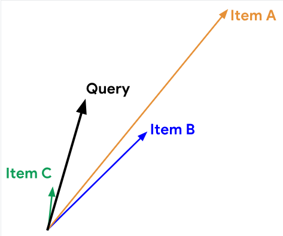
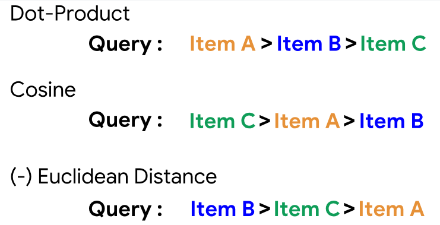
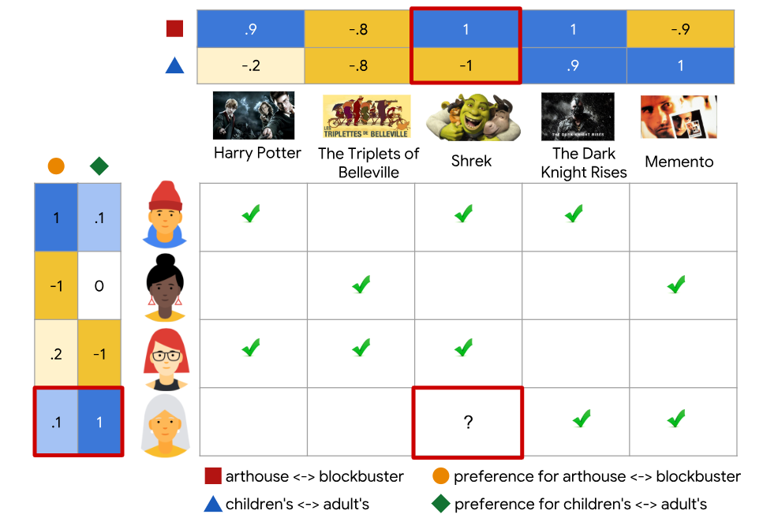
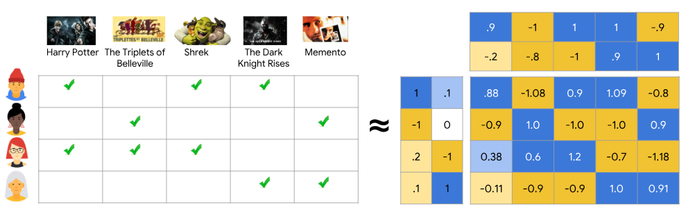

# Recommendation systems

## Recommendations
- home page recommendations
- related item recommendations

## Terminology
- Items/documents: entities a system recommends
- Query/context: information a system uses to make recommendations

## Embedding
- A mapping from a discrete set to a vector space called the embedding space

## Components
- Candidate generation: generates a much smaller subset of candidates
- Scoring: scores and ranks the candidates
- Re-ranking: take into account additional constraints for the final ranking

---

## Candidate generation overview
- First stage of recommendation
- Select relevant candidates
- content-based filtering: similarity between items
- collaborative filtering: similarities between queries and items

## Embedding space
- low-dimensional
- closeness is defined by a similarity measure

## Similarity measures
= function that takes a pair of embeddings and returns a scalar measuring their similarity
- given a query embedding, the system looks for item embeddings that are close to embeddings with high similarity
- cosine: angle
- dot product
- Euclidean distance: smaller distance = higher similarity

## Which similarity measure
- Dot product similarity is sensitive to the norm of the embedding
- Frequent items tend to have embeddings with large norms
- Rare items may not be updated regularly during training
- If rare items are initialised with large norm, system may recommend rare itesm over more relevant items
- Require appropriate regulisation

## Content-based filtering
- uses item features to recommend other items similar to what the user likes
- base on previous actions or explicit feedback
- feature matrix (hand-engineering)

### Advantages
- Specific to user
- Capture specific interests of user

### Disadvantages
- Hand-engineered to some extent
- Requires a lot of domain knowledge
- Based on existing interests of user

## Collaborative filtering
- similarities between users and items simultaneously
- no hand-engineering of features
- Explicit feedback: users specify how much they liked a particular movie by providing a numerical rating.
- Implicit feedback: if a user watches a movie, the system infers that the user is interested.
- similarity to movies the user has liked in the past
- movies that similar users liked

### Embedding
- 1D embedding: movies for children (-1 to 0), movies for adults (0 to 1)
- 2D embedding: arthouse (-1 to 0), blockbuster (0 to 1)
- Feedback matrix: dot product of user and item embedding

### Matrix factorisation
- Simple embedding model
- given feedback
- user embedding matrix
- item embedding matrix
- more compact representation than learning the full matrix
- matrix factorization finds latent structure in the data

### Choosing objective function
- One intuitive objective function is the squared distance
- Singular Value Decomposition (SVD)
- Weighted Matrix Factorization

### Minimising the objective function
| Stochastic gradient descent (SGD) | Weighted Alternating Least Squares (WALS) |
|---|---|
| generic method to minimize loss functions | specialized to this particular objective |
| Flexible: other loss functions | reliant on loss squares only |
| Can be parallelised | can be parallelised |
| Slower | converges faster |
| Hard to handle unobserved entries | easier to handle unobserved entries |

### Collaborative filtering advantages
- No domain knowledge necessary
- Serendipity
- Great starting point

### Collaborative filtering disadvantages
- Cannot handle fresh items
  - cold-start problem: if item not seen in training, the system can't create embedding
  - projection in WALS
  - heuristics to generate embeddings of fresh items
- Hard to include side features for query/item
  - Side features are features beyond query/item ID
  - Generalise WALS: augment input matrix with features 
